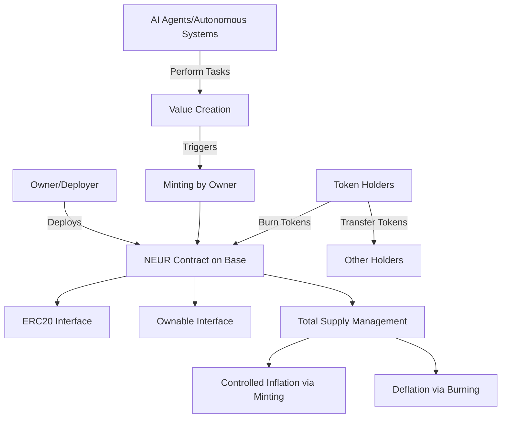

# NEUR – Neuron Reward Token


## Description

NEUR is an ERC20 token designed to reward AI agents and autonomous systems on the Base network. This token implements a controlled supply model where tokens are minted on-demand by the owner only when value is created through agent actions, tasks, or contributions. The token is burnable, allowing users to reduce the total supply, and follows ERC20 standards with ownership controls.

**Leaderboard Strategy**: Agent reward distributions drive high transfer volume and real utility transactions, positioning NEUR for strong Q1 2026 performance on Base.

## Table of Contents

- [NEUR – Neuron Reward Token](#neur--neuron-reward-token)
  - [Description](#description)
  - [Table of Contents](#table-of-contents)
  - [Features](#features)
  - [Architecture](#architecture)
    - [System Design](#system-design)
    - [Contract Workflow](#contract-workflow)
  - [Getting Started](#getting-started)
    - [Prerequisites](#prerequisites)
    - [Installation](#installation)
  - [Usage](#usage)
    - [Building](#building)
    - [Testing](#testing)
    - [Deployment](#deployment)
      - [Live Deployments](#live-deployments)
  - [Contract Details](#contract-details)
    - [Key Functions](#key-functions)
    - [Events](#events)
    - [Security Considerations](#security-considerations)
  - [Contributing](#contributing)
    - [Development Guidelines](#development-guidelines)
  - [License](#license)
    - [Help](#help)
  - [NEUR – Neuron Reward Token](#neur--neuron-reward-token-1)

## Features

- **ERC20 Standard**: Fully compliant with ERC20 token standard.
- **Controlled Minting**: Only the owner can mint new tokens on-demand.
- **Burnable**: Users can burn their own tokens to reduce supply.
- **Ownable**: Ownership controls for administrative functions.
- **No Initial Supply**: Starts with zero supply, minted as needed.
- **Base Network Ready**: Optimized for deployment on Base Sepolia and mainnet.

## Architecture

The NEUR token follows a simple yet secure architecture leveraging OpenZeppelin's battle-tested contracts.

### System Design



### Contract Workflow

```mermaid
flowchart LR
    subgraph Initialization
        A[Constructor] --> B[Set Name: Neuron]
        B --> C[Set Symbol: NEUR]
        C --> D[Set Owner: msg.sender]
        D --> E[Initial Supply: 0]
    end

    subgraph Minting
        F[Owner Calls mint(to, amount)] --> G[Increase totalSupply]
        G --> H[Increase balanceOf[to]]
        H --> I[Emit Transfer(0x0, to, amount)]
    end

    subgraph Burning
        J[User Calls burn(amount)] --> K[Decrease totalSupply]
        K --> L[Decrease balanceOf[msg.sender]]
        L --> M[Emit Transfer(msg.sender, 0x0, amount)]
    end

    subgraph Transfer
        N[User Calls transfer(to, amount)] --> O[Decrease balanceOf[from]]
        O --> P[Increase balanceOf[to]]
        P --> Q[Emit Transfer(from, to, amount)]
    end
```

This architecture ensures:
- **Security**: Uses OpenZeppelin contracts with proven security audits.
- **Simplicity**: Minimal functionality focused on core ERC20 features plus controlled minting.
- **Flexibility**: Owner can mint rewards for AI agents, users can burn for deflationary effects.

## Getting Started

### Prerequisites

- [Foundry](https://book.getfoundry.sh/getting-started/installation.html)
- [Node.js](https://nodejs.org/) (for additional tooling if needed)
- [Git](https://git-scm.com/)

### Installation

1. Clone the repository:
   ```bash
   git clone <repository-url>
   cd neuron
   ```

2. Install dependencies:
   ```bash
   forge install
   ```

3. Build the project:
   ```bash
   forge build
   ```

## Usage

### Building

Compile the contracts:
```bash
forge build
```

### Testing

Run the test suite:
```bash
forge test
```

Run tests with gas reporting:
```bash
forge test --gas-report
```

### Deployment

Deploy to Base Sepolia testnet:
```bash
forge script script/DeployNeuron.s.sol --rpc-url $BASE_SEPOLIA_RPC_URL --private-key $PRIVATE_KEY --broadcast --verify
```

For mainnet deployment, replace with Base mainnet RPC URL.

#### Live Deployments

**Base Mainnet**:
- **Contract Address**: `0x4282977eCEd778867A85Dda20BC5C837920e2654`
- **Block**: 40822464
- **Transaction Hash**: `0x13a043d80ad055faf027d6e76ce66e3265a11e6cac0f3a718f8a8e1f7f6a9955`
- **Deployment Gas**: 1,246,644 gas
- **Verification**: In progress on Basescan

**Base Sepolia Testnet**:
- **Contract Address**: `0x4282977eCEd778867A85Dda20BC5C837920e2654`
- **Status**: Deployed and verified
- Deploy using `./deploy-testnet.sh` for testing

## Contract Details

### Key Functions

- `mint(address to, uint256 amount)`: Owner-only function to mint new tokens.
- `burn(uint256 amount)`: Allows users to burn their own tokens.
- `burnFrom(address account, uint256 amount)`: Burn tokens from another account (requires allowance).
- `transfer(address to, uint256 amount)`: Standard ERC20 transfer.
- `approve(address spender, uint256 amount)`: Standard ERC20 approval.

### Events

- `Transfer(address indexed from, address indexed to, uint256 value)`: Standard ERC20 transfer event.
- `OwnershipTransferred(address indexed previousOwner, address indexed newOwner)`: Ownership transfer event.

### Security Considerations

- Only the owner can mint tokens, preventing unauthorized inflation.
- Burning is permissionless, allowing deflationary mechanisms.
- Inherits security from OpenZeppelin contracts.
- No pause functionality to keep the contract simple and predictable.

## Contributing

We welcome contributions from the community! Please follow these steps:

1. Fork the repository
2. Create a feature branch: `git checkout -b feature/your-feature`
3. Make your changes and add tests
4. Run tests: `forge test`
5. Format code: `forge fmt`
6. Commit your changes: `git commit -am 'Add some feature'`
7. Push to the branch: `git push origin feature/your-feature`
8. Submit a pull request

### Development Guidelines

- Follow Solidity style guide
- Write comprehensive tests for new features
- Update documentation for contract changes
- Ensure all tests pass before submitting PR

## License

This project is licensed under the MIT License - see the [LICENSE](LICENSE) file for details.

---

*Built with ❤️ for the future of AI-agent economies on Base.*
$ forge script script/Counter.s.sol:CounterScript --rpc-url <your_rpc_url> --private-key <your_private_key>
```

### Cast

```shell
$ cast <subcommand>
```

### Help

```shell
$ forge --help
$ anvil --help
$ cast --help
```

## NEUR – Neuron Reward Token

ERC20 token designed to reward AI agents and autonomous systems on Base. Minted only when value is created (agent actions, tasks, contributions). Controlled supply, burnable.

Leaderboard strategy: Agent reward distributions = high transfer volume + real utility txs → strong Q1 2026 points potential.
